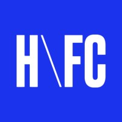

<h2>Hi! 👋</h2>

  <a href="https://www.linkedin.com/in/silvia-fang/">
    
  <a/>
    
  <a href="mailto:fang.silvia@gmail.com">
    
  <a/>

- 🐱 I'm Silvia, a Computer Science, Communication Studies, & Design undergrad at Northwestern University
- 🗺️ Currently learning more about accessible technologies & design
- 💼 Working at  <a href="https://homefromcollege.com/">H\FC<a/> and  <a href="wildhacks.net">Northwestern WildHacks<a/>
- 🔧 Also contributing to amazing start-ups @ <a href="https://www.thegarage.northwestern.edu/">The Garage at Northwestern<a/>

- 🌸 See more of my work at [silviafang.com](https://silviafang.com)
- 💥 Feel free to reach out about any work opportunities!

  
<h6>embarrassing github stats :computer:</h6>

   
  
  
  
  

<!--
**verisorry/verisorry** is a ✨ _special_ ✨ repository because its `README.md` (this file) appears on your GitHub profile.

Here are some ideas to get you started:

- 🔭 I’m currently working on ...
- 🌱 I’m currently learning ...
- 👯 I’m looking to collaborate on ...
- 🤔 I’m looking for help with ...
- 💬 Ask me about ...
- 📫 How to reach me: ...
- 😄 Pronouns: ...
- ⚡ Fun fact: ...
-->
