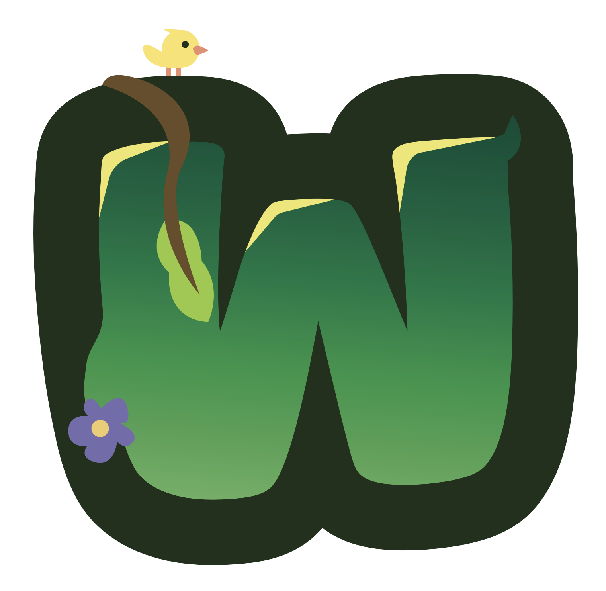

## Hi! 👋

  <a href="https://www.linkedin.com/in/silvia-fang/">
    
  <a/>
    
  <a href="mailto:fang.silvia2026@gmail.com">
    
  <a/>

- 🧋 I'm Silvia, a Computer Science, Communication Studies, & Design undergrad at Northwestern University
- 📑 Currently researching and writing about the architecture of digital community when no one's in charge
- 💼 Working on  [Northwestern WildHacks](https://www.wildhacks.net/) and contributing to amazing start-ups @ [The Garage at Northwestern](https://www.thegarage.northwestern.edu/)

- 🌸 See more of my work at [silviafang.com](https://silviafang.com)

  <picture>
    <source media="(prefers-color-scheme: dark)" srcset="https://raw.githubusercontent.com/verisorry/verisorry/output/github-contribution-grid-snake-dark.svg"/>
    <source media="(prefers-color-scheme: light)" srcset="[output/github-snake.svg](https://raw.githubusercontent.com/verisorry/verisorry/output/github-contribution-grid-snake.svg)" />
    
  </picture>

<em>Inspired by <a href="https://github.com/sleepymalc/sleepymalc">sleepymalc</a></em>

  
<h6>embarrassing github stats :computer:</h6>

   
  
  
  

<!--
**verisorry/verisorry** is a ✨ _special_ ✨ repository because its `README.md` (this file) appears on your GitHub profile.

Here are some ideas to get you started:

- 🔭 I’m currently working on ...
- 🌱 I’m currently learning ...
- 👯 I’m looking to collaborate on ...
- 🤔 I’m looking for help with ...
- 💬 Ask me about ...
- 📫 How to reach me: ...
- 😄 Pronouns: ...
- ⚡ Fun fact: ...
-->
